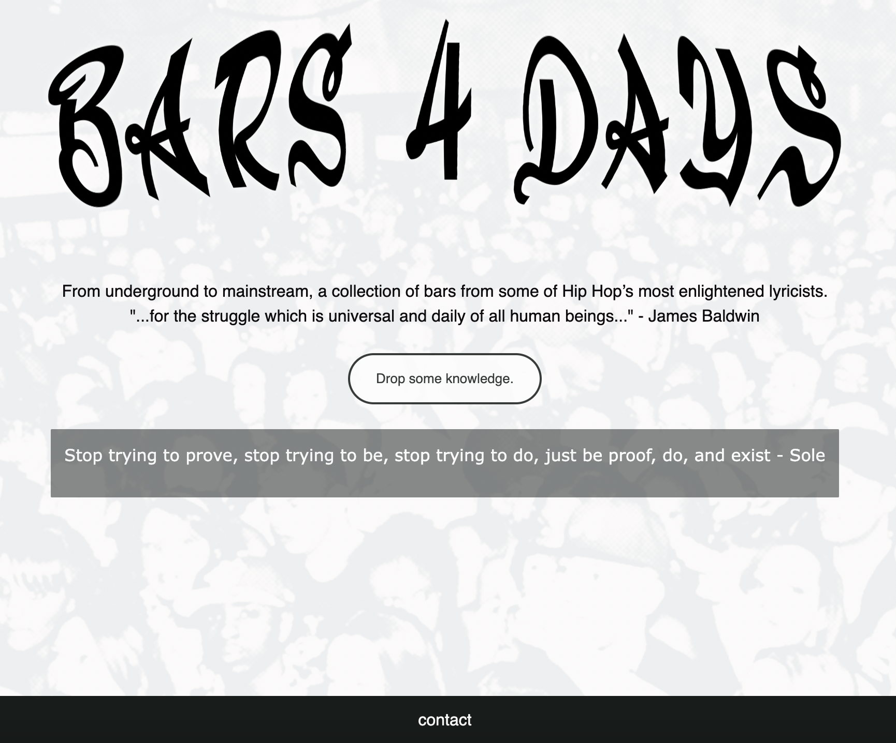

# Bars4Days
#### Video Demo: [Bars4Days](https://youtu.be/q4voq-QGIVg)
#### Description: Bars4Days is a quote generator which generates quotes (bars) from some of Hip Hop's most enlightened lyricists.
This project utilizes Flask, Python, and CSS to generate and display quotes from a database compiled by myself. These words have
served as inspiration to myself at one point or another and I wish to help spread these words to more eyes and ears in hopes
of inspiring or consoling. Enjoy!

requirements.txt: Lists requirements needed to run app.py This application requires modules: cs50, Flask, Flask-Session, requests,
quoprimime, and random.

app.py: The brains of the opperation. First we import from our modules. Then we define what we're routing to our index page. Here
we declare the variable bars. Then we open our csv file and read the data into a variable \'bars_data'\. Then we use the \'next'\
so that we don't post row 0. Next we use the \'append'\function to extract the bars with their corresponding artist and appends to the bars variable. Next we use the \'random'\ module and generate our random bars which gets assigned to the \'bar'\ variable. Then
we send \'bar'\ to index page when we return the function \'render_template'\

index.html: Displays the contents. Topped with a custom banner displaying the title of the website. Below is a brief description
of the site stating \'From underground to mainstream, a collection of bars from some of Hip Hop’s most enlightened lyricists.'\,
Below that is a quote \'"...for the struggle which is universal and daily of all human beings..." - James Baldwin'\ which encompassesthe ethos of the site. Below that is a button labled \"Drop some knowledge."\ which when clicked generates a new quote in the text field below. At the bottom of the page is a contact link to send an email to webmaster

styles.css: Used to stylize webpage. Items that are stylized include: body, container, button, button a, button a:hover, header, foot, foot ul, foot li, foot li a, foot li a:hover, table, tr.head, tr, p.indent

bars.csv: This is the data compiled by myself. The fields in this dataset are: bar_id, artist name, bar, track name, album title,
spotify link, and tag.

While the project is what it is for now, I plan to continue working on this project in the future. I would like to incorporate an
album picture which links to the spotify link so that the user could listen to the track. I would also like to add a login function which would offer the user an additional page to allow for submissions which would be added to the user's database and reviewd by webmaster for possible addition to master database. Additionally I would like to add functionality to have the browser speak the bar generated as well as copy to clipboard and post to social media.

Bars4Days focuses on quotes from the Hip Hop genre, which I plan to continue compiling, but I would also like to expand across
various genres. It is my hope to create a sort of Bible of underground music with a collection of words of wisdom, encouragement and solace. While there are many religions around the world mine is music. Between headphones is my place of worship. Music has helped me navigate life's treacherous waters and I would like to pay that gift forward to willing ears(eyes). Thank you.

